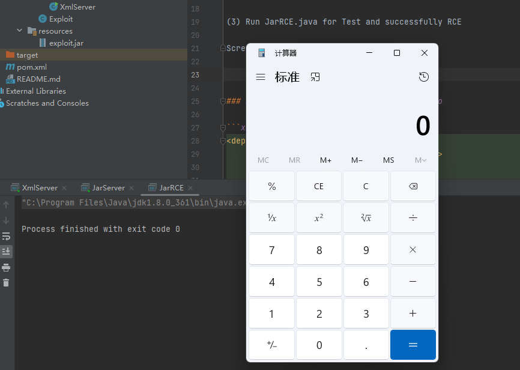
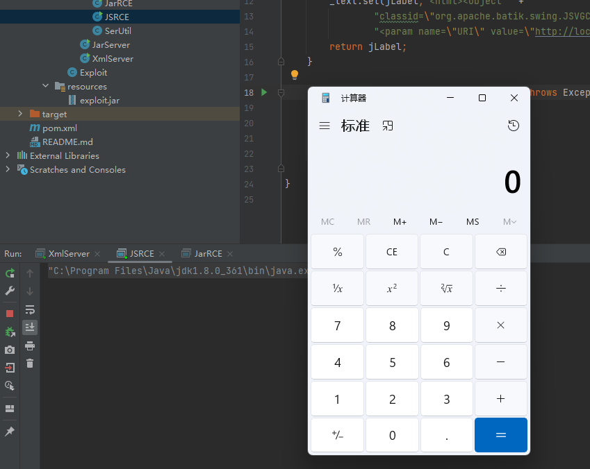

## JDK CVE-2023-21939

[文章链接](https://mp.weixin.qq.com/s?__biz=MzkzOTQzOTE1NQ==&mid=2247483750&idx=1&sn=12a793075d0a8713bbfb4341b3591628&chksm=c2f1a43af5862d2cc898be9e4b43b24d24b29173501d3c10d812a8fcb7dd25d858e3095969ea#rd)

This is JDK CVE-2023-21939

Use JDK version lower than 8u371

### JDK + Apache XML Graphics

```xml
<dependency>
    <groupId>org.apache.xmlgraphics</groupId>
    <artifactId>batik-swing</artifactId>
    <version>1.15</version>
</dependency>
```

How to reproduce this RCE:

(1) Run XmlServer.java 

(2) Run JarServer.java

(3) Run JarRCE.java for Test and successfully RCE

Screenshot:



### JDK + Apache XML Graphics + Mozilla Rhino

```xml
<dependency>
    <groupId>org.apache.xmlgraphics</groupId>
    <artifactId>batik-swing</artifactId>
    <version>1.15</version>
</dependency>
<dependency>
    <groupId>org.mozilla</groupId>
    <artifactId>rhino</artifactId>
    <version>1.7.10</version>
</dependency>
```

How to reproduce this RCE:

(1) Run XmlServer.java

(2) Run JSRCE.java for Test and successfully RCE

Screenshot:


